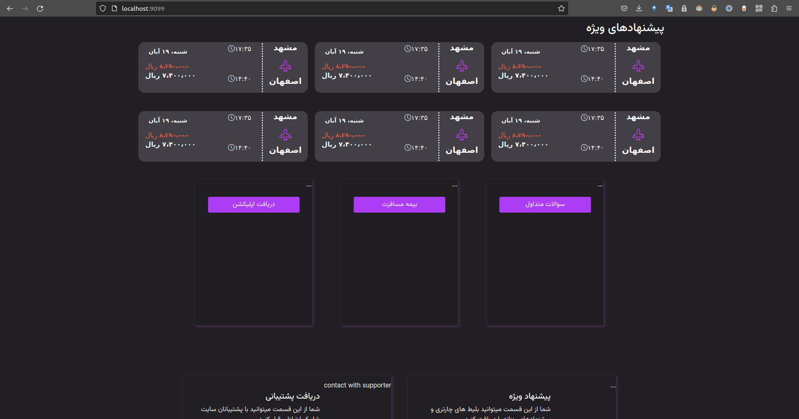

## dockerfile

```Dockerfile
FROM nginx
COPY *.html /usr/share/nginx/html/
COPY *.css /usr/share/nginx/html/ 
COPY *.svg /usr/share/nginx/html/
COPY scripts/*.js /usr/share/nginx/html/scripts/
COPY assets/* /usr/share/nginx/html/assets/
```

## command

```shell
sudo docker build -t web/front .
sudo docker run -p 9099:80 -d web/front
```

## output

```shell
 % sudo docker build -t web/front .       
Sending build context to Docker daemon  9.134MB
Step 1/6 : FROM nginx
 ---> 3f8a00f137a0
Step 2/6 : COPY *.html /usr/share/nginx/html/
 ---> Using cache
 ---> 5b7a8a8c3a07
Step 3/6 : COPY *.css /usr/share/nginx/html/
 ---> 41b7d8971d32
Step 4/6 : COPY *.svg /usr/share/nginx/html/
 ---> 19fc75ce93c6
Step 5/6 : COPY scripts/*.js /usr/share/nginx/html/scripts/
 ---> bbd81a2eb69a
Step 6/6 : COPY assets/* /usr/share/nginx/html/assets/
 ---> 3de5ff7085f9
Successfully built 3de5ff7085f9
Successfully tagged web/front:latest

11b383083e7f51d2333bd5b277d4580592a93b2cd50424a9f3bd2d9e95944f46
```

## test

